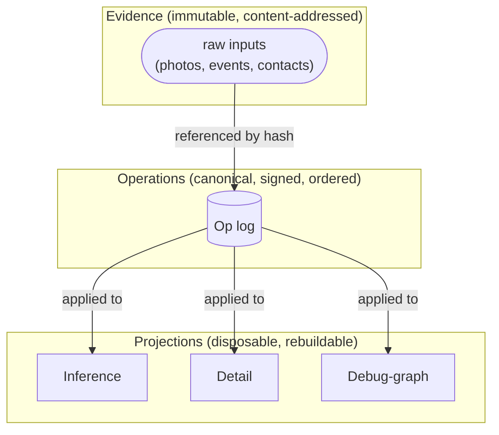

# Data Model

This chapter defines the structural elements an implementation
manipulates: evidence, operations, projections, and the identifier
types that link them. It does not define wire encodings (see
[Wire Format](03-wire-format.md)) or the full operation taxonomy
(see [Operations](02-operations.md)).

## 1. Layers

A conforming implementation MUST distinguish three layers:

1. **Evidence** — immutable, content-addressed inputs the user has
   ingested.
2. **Operations** — typed, signed, totally-ordered records of state
   change. The operation log is the canonical store of truth.
3. **Projections** — materialised read views derived from the
   operation log. Projections are disposable and rebuildable.

Higher layers in this list depend only on lower layers. Operations
reference evidence by hash. Projections are computed from the
operation log. No projection's state may be mutated except by
applying operations.

Evidence content (the photo bytes, the calendar payload) MAY be
stored separately from the op log in any way an implementation
chooses, including not at all on a given node, so long as the
content hash recorded in the operation referencing it remains
verifiable when the bytes are present.

## 2. Identifier types

The protocol uses several typed identifier categories. Where this
specification refers to an "Id" of a particular kind, the
identifier MUST belong to that category. Implementations SHOULD
prevent cross-category confusion at the type level where the
implementation language permits it.

### 2.1 NodeId

A `NodeId` is a long-lived identifier for a node. A `NodeId` MUST
correspond, one-to-one, to an Ed25519 public key used for op
signing. The mapping is established when a node first authors a
`DelegateUcan` op announcing its presence and is fixed for the
lifetime of the node.

A `NodeId` is assigned by the implementation at node initialisation
and MUST be unique within a mesh. The protocol does not specify
the encoding of NodeId beyond requiring that it be a stable byte
string suitable for use as a map key and a JWS `kid` value.

### 2.2 ULID-shaped record identifiers

The following identifiers are time-sortable [ULID](https://github.com/ulid/spec)-
shaped values: `OpId`, `EvidenceId`, `EntityId`, `ClaimId`,
`JobId`, `ArtifactId`, `EpisodeId`, `ActionId`. Implementations
MUST treat each as opaque outside the operations that produce
them, except that ULID-derived total ordering MAY be relied upon
for tie-breaking where the specification calls for it
(e.g. last-write-wins entity merge in
[Mesh Coordination](09-mesh-coordination.md)).

### 2.3 ContentHash

A `ContentHash` is a 32-byte BLAKE3 hash of canonical bytes. It is
used to reference:

- Evidence payloads (the photo, the calendar event content).
- UCAN tokens (for proof-chain references).
- Mesh-rules documents (for the sync handshake).

`ContentHash` values MUST be encoded as 32 raw bytes on the wire
and MAY be encoded as 64-character lowercase hex in human-readable
contexts.

### 2.4 DID

The user is identified by a Decentralized Identifier (DID). The
protocol does not constrain the DID method; `did:key` and
`did:plc` are both acceptable. The user's DID is the issuer of
the root delegation in a mesh.

A node's signing key is bound to its `NodeId` rather than to a DID
directly; the binding from `NodeId` to a DID is established by
the chain of UCAN delegations rooted at the user.

## 3. Evidence

### 3.1 Identity

Each piece of evidence has:

- An `EvidenceId` (assigned by the ingesting node).
- A `ContentHash` of the canonical content.
- A `SourceAnchor` — a stable identifier from the upstream system
  the content was ingested from (calendar event UID, photo asset
  identifier, message identifier). Multiple nodes that ingest the
  same upstream item MUST agree on the `SourceAnchor`.
- A `source_type` — a short string identifying the kind of
  upstream system (`"calendar"`, `"photo"`, `"contact"`,
  `"location"`, ...). This is the value matched by the
  `source_types` capability caveat (see
  [UCAN and Caveats](07-ucan-and-caveats.md)).
- Optional custom metadata.

### 3.2 Immutability

Evidence is immutable. Once an evidence-ingest operation lands on
the log, the content referenced by that op's `ContentHash` MUST
NOT change. To remove evidence, the user (or an authorised node)
emits a `TombstoneEvidence` op, which triggers a derivation
cascade.

Tombstoning preserves the evidence-ingest op on the log. An
implementation MUST NOT delete the original op; the historical
record of *what was once known* survives, even if the implementation
has discarded the underlying content bytes.

### 3.3 Cascade

When an evidence record is tombstoned, every claim, entity merge,
episode, suggested action, and inference snapshot that
transitively depended on it MUST be invalidated. The mechanism is
specified in [State Machines](12-fsms.md). The operation that
tombstones evidence is itself the cascade: a `CascadeTombstone`
op carries the set of dependent records it invalidates, atomically.

## 4. Operations

### 4.1 Common shape

Every operation, regardless of payload variant, carries the
following fields:

- `op_id`: an `OpId` assigned by the authoring node.
- `author`: the `NodeId` of the authoring node.
- `timestamp`: a [hybrid logical clock](05-clocks.md) value
  `(wall_ms, logical, node)`.
- `payload`: a typed payload; see [Operations](02-operations.md)
  for the variants.
- `signature`: an Ed25519 signature over the canonical encoding
  of the op with the `signature` field cleared. See
  [Signatures](06-signatures.md) and [Wire Format](03-wire-format.md).

An operation with a missing signature is valid only if it has
been intentionally sanitised by an authorised filter (see
[UCAN and Caveats](07-ucan-and-caveats.md)). All other
unsigned ops MUST be rejected.

### 4.2 Total order

The triple `(timestamp.wall_ms, timestamp.logical,
timestamp.node)` induces a total order over all operations in a
mesh. Where this specification requires ops to be applied "in
order," it means in this total order.

Two operations with the same `(wall_ms, logical, node)` MUST NOT
exist; that case is a violation of the HLC tick discipline (see
[Clocks](05-clocks.md)) and the receiving node MUST treat it as
an authoritative integrity failure.

### 4.3 Idempotence

Application of an operation to a projection MUST be idempotent. A
node that receives the same op twice MUST produce the same
projected state as if it had received it once.

Implementations typically achieve this by deduplicating on
`op_id` at the log layer, but the requirement is on the projected
state, not on the deduplication mechanism.

## 5. Projections

A projection is a materialised view computed from the operation
log. Projections are derived state — they MUST be fully
reconstructable from the op log alone.

A conforming implementation MUST provide projections sufficient
to answer the queries described in [Projections](10-projections.md).
The protocol distinguishes four projections **by purpose**, not by
implementation strategy:

- **Salience projection** — for ranking what is currently
  important.
- **Inference projection** — for assembling a model context window.
- **Detail projection** — for per-id user-interface lookups; the
  on-disk read layer.
- **Debug-graph projection** — for inspection and verification
  tooling. Optional in production.

Implementations MAY combine the underlying storage of multiple
projections; they MUST NOT collapse the read interfaces such that
the query semantics of one projection contaminate another. The
load-bearing distinction is between *what each projection answers*,
not between *where its bytes live*. See [Projections](10-projections.md)
for the contract each projection must honour.

## 6. The provenance graph

The relationships between evidence, claims, and other derived
records form a directed acyclic graph (DAG). The vertices are
records; the edges are "derived from" links carried in the
operation that produced the derived record.

A conforming implementation MUST:

- Record the supporting operations of every derived claim, episode,
  and suggested action. The set of supporting operations MUST be
  recoverable from the op log.
- Treat the derivation graph as a DAG. An operation that would
  introduce a cycle into the derivation graph MUST be rejected.
- Implement transitive invalidation: when a vertex is tombstoned
  or rejected, every vertex transitively reachable along outgoing
  edges MUST be invalidated. The state-machine consequences of
  invalidation are specified in [State Machines](12-fsms.md).

The entity-resolution graph (which entity merges into which) is
*not* required to be acyclic; the merge-conflict resolution rules
in [Mesh Coordination](09-mesh-coordination.md) handle the
cyclic case deterministically.

## 7. Authoring authority

An operation is *authorised* if and only if its author held a
capability admitting both the operation's `Action` (the kind of
write it performs) and its `Resource` (the data class it touches),
with caveats satisfied, at the operation's `timestamp`.

Authorisation is verified by walking the chain of UCAN
delegations from the op's author to the mesh root. The mechanism
is specified in [UCAN and Caveats](07-ucan-and-caveats.md) and
[Capabilities](08-capabilities.md). A receiving node MUST reject
operations it cannot authorise.

## 8. Informative: a worked example

> An informative section. Does not impose requirements.

The user's phone ingests a calendar event. The phone:

1. Computes the BLAKE3 hash of the canonical calendar event bytes.
2. Allocates an `EvidenceId`.
3. Builds an `IngestEvidence` op with `source_type = "calendar"`,
   the `ContentHash`, the upstream UID as the `SourceAnchor`, and
   any extracted metadata in the custom-metadata field.
4. Ticks its HLC, writes the op's `timestamp`.
5. Signs the op with the phone's NodeId key (detached JWS over
   canonical encoding, signature field cleared during signing).
6. Appends the signed op to the local log.

A subsequent deterministic-extraction pass on this evidence
produces candidate claim ops with `Hint` status, each carrying
this evidence's `EvidenceId` in its supporting-operations field.
A later inference call may produce an episode op whose supporting
operations include both the evidence and the claims. A still-later
user assertion may confirm one of those claims, transitioning it
to `Fact`.

Every step of that pipeline is on the log. Every record above
evidence has a path back to evidence. The user can walk that path
in either direction.
