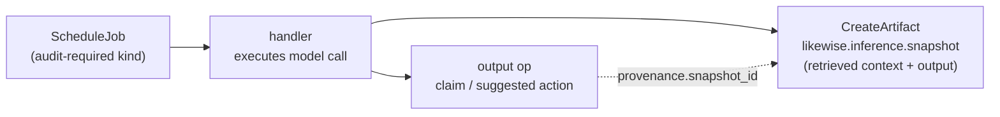

# Inference Audit

> **Part 2 of the specification, second chapter.** This chapter
> depends on the substrate (Part 1) for op log, capabilities,
> and the generic artefact mechanism, and on the previous
> chapter ([Mesh Coordination & Inference](09-mesh-coordination.md))
> for job and lease semantics. It specifies the convention by
> which inference calls become recoverable artefacts on the log.

The Likewise substrate (Part 1) lets a user own the
canonical record of facts derived about them. The mesh
coordination layer (the previous chapter in Part 2) lets
multiple nodes cooperate on the work of producing those derived
records. This chapter specifies the third concern of Part 2:
how the *inference itself* — the model calls that produce many
of the protocol's derived records — becomes recoverable and
auditable.

Audit is what closes the "how did it know?" loop. A
recommendation, a derived claim, a synthesised episode — each
can be traced back, mechanically, to the model call that
produced it, the prompt and context fed to that call, and the
model's literal output. The mechanism is the
`likewise.inference.snapshot` artefact: a typed artefact emitted
alongside any audited inference call, riding the substrate's
generic artefact machinery.

The chapter is short because the mechanism is small. Audit
requires three things:

1. a rule about *when* a node must emit snapshots,
2. a *content format* for the snapshot artefact, and
3. a *linking convention* that ties produced records back to the
   snapshot.

Each is specified in turn below.

## 1. When a snapshot must be emitted

A node MUST emit a `likewise.inference.snapshot` artefact for every
model call it performs in either of the following cases:

1. **The node is operating under the user's root delegation.**
   The reference implementation, and any node a user runs on
   their own devices, falls into this category. For such nodes
   audit is the default; an inference call without a
   corresponding snapshot is a violation of v0.1 conformance,
   regardless of what other invariants the implementation
   satisfies. This is what makes the user's own personal mesh
   auditable end-to-end.

2. **The node is operating under a delegation whose `caveats`
   include `audit_inference: true`.** A user delegating to an
   organisation's node MAY attach this caveat (specified in
   [UCAN and Caveats §5.6](07-ucan-and-caveats.md#56-audit_inference))
   to require the delegated node to emit snapshots for inference
   performed against the delegated data. The snapshots become
   themselves operations on the user's log, completing the audit
   loop across the delegation boundary.

In all other cases — a delegated node operating without an audit
caveat — snapshot emission is *optional*. The node MAY emit
snapshots for its own bookkeeping but is not required to. What
the node does internally with the data it received is governed
by the delegation's other caveats and by whatever out-of-band
agreements the user and the delegated party have, not by this
chapter.

This split is deliberate. The protocol's role is to let the user
*decide* whether audit applies, not to mandate it for every party
that ever processes a piece of the user's graph. Mandating audit
universally would be unenforceable across organisational
boundaries; making it caveat-controlled gives the user the lever
they need without overreaching.

## 2. The `likewise.inference.snapshot` artefact

A `likewise.inference.snapshot` artefact is a `CreateArtifact` op
(see [Operations §8.1](02-operations.md#81-createartifact)) whose
`artifact_type` is the literal string
`"likewise.inference.snapshot"`. The artefact's content (the
bytes referenced by `content_hash`, optionally inlined via
`content_inline`) MUST be a postcard-encoded record with the
following fields, in this order:

| Field | Purpose |
|-------|---------|
| `model_id` | The identifier of the model used (e.g. `"gemma-4-E2B-Q4_K_M"`). |
| `model_version` | The model-specific version or revision tag. |
| `backend` | The inference backend (`"llama-cpp"`, `"litert-lm"`, ...). |
| `retrieved_context` | The structured set of evidence ids, claim ids, and entity ids that were assembled into the prompt. |
| `prompt` | The literal prompt sent to the model, including system message and user turns. |
| `output` | The model's response, including any structured fields the handler parsed out. |
| `telemetry` | Wall-clock duration, token counts (prompt + completion), latency components if available. |
| `started_at`, `completed_at` | HLC values bracketing the call. |

The artefact's envelope `source_job` field MUST be set to the
`job_id` of the job whose handler made the call. The
`inputs_used` field MUST list every evidence id in
`retrieved_context` (the substrate's generic-artefact contract
already requires this for any artefact produced from evidence).

Additional implementation-specific fields MAY be present in the
encoded record. Future minor versions of this specification MAY
add reserved fields; an implementation that does not understand
a future field MUST preserve it during round-trip rather than
discarding it.

## 3. Linking from outputs to snapshots

Any record produced by a snapshot-emitting inference call MUST
link back to the snapshot. Specifically:

- A derived `CreateClaim` op produced by inference MUST include
  the snapshot's `artifact_id` in its `provenance` field.
- A `CreateArtifact` op for any non-snapshot artefact produced by
  the same job (an embedding, a transcript) MUST set its
  `source_job` to the same job whose snapshot also references it,
  and SHOULD additionally include the snapshot's `artifact_id`
  in `causal_deps`.
- For nodes that implement the application-layer conventions in
  the [annex](annex-conventions.md), a `CreateEpisode` op
  produced by inference MUST include the snapshot's
  `artifact_id` in its `causal_deps`. A
  `CreateSuggestedAction` op MUST set its `derivation_job` to
  the producing job and MUST additionally include the
  snapshot's `artifact_id` in `causal_deps`.

This is the chain that makes the "how did it know?" question
mechanically answerable. Walking from any audited output to its
snapshot, then from the snapshot to its `retrieved_context`, is
the literal audit path.

A receiver MUST reject an audited output op whose link to a
snapshot is missing or unresolvable on the local log. "Audited
output" means: an op whose authoring node is operating under
audit-in-force per Section 1, that the spec or a convention
identifies as a class for which audit linking is required.

## 4. Snapshot lifecycle

Snapshot artefacts inherit the substrate's generic artefact
lifecycle (eviction, tombstone-cascade) from
[Operations §8.1–§8.2](02-operations.md#81-createartifact). A
node MAY set `ttl_ms` on snapshots it emits; once the TTL
elapses, the snapshot is eligible for eviction under storage
pressure.

Eviction is irreversible: once evicted, the snapshot's content
is gone and the audit chain is broken from that point forward
for any output that depended on the evicted snapshot. The
`CreateArtifact` op remains on the log, so the *existence* of
the inference call is still recoverable; only the contents
(retrieved context, prompt, output) are lost.

Implementations operating under the user's root delegation
SHOULD retain snapshots for at least the lifetime of the records
that link to them, treating eviction as a last-resort under
storage pressure. The user's own audit trail is among the most
load-bearing data in the mesh; evicting it freely defeats the
point.

Implementations operating under an `audit_inference` caveat
SHOULD respect any retention window the delegating user has
expressed in the delegation or in mesh-rules. v0.1 does not
specify a wire-level retention-window field; the user
communicates retention expectations through other means.
Strengthening this is an [open issue](99-open-issues.md).

## 5. Relationship to the audit invariant

The normative consequence of this chapter is captured in
[Invariants §I-9](11-invariants.md#i-9-inference-is-recorded-when-audit-is-in-force).
That invariant is the binding requirement; this chapter
specifies the mechanism by which the invariant is satisfied.

A reader who wants the short version reads I-9. A reader who is
implementing the audit layer reads this chapter.

## 6. What audit does *not* cover

The audit mechanism specified here is deliberately narrow. It
covers:

- **Inference performed by a Likewise node**, where
  "inference" means a call to a model that produces user-visible
  derived records.

It does *not* cover:

- **Inference performed off-protocol.** A delegated party that
  receives a slice of the user's data and trains an internal
  model on it has not made a "Likewise inference call"
  for the purposes of this chapter, regardless of whether the
  user might wish they had. The protocol's lever for that
  scenario is the delegation's caveats — the user can refuse to
  delegate the data — not the audit invariant.

- **Statistical or aggregate inference.** A retailer that
  receives many users' grocery rhythms and computes population
  statistics has not, under v0.1, performed a per-user inference
  call. Their internal pipeline is theirs to govern.

- **Auditing the model itself.** The snapshot records the model
  identifier, but the protocol does not specify how to verify
  that the named model was actually the model that produced the
  output. Model attestation is a separate concern.

These exclusions are real and worth being explicit about. Audit
is an important property the protocol provides; it is not a
property the protocol can extend beyond its own boundaries.
