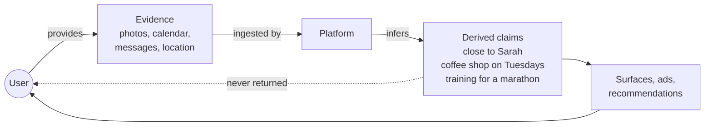

# Motivation

## Where the value is moving

For most of the consumer software era, the question of "who owns your
data" had a clean enough answer to ignore: you owned the photos and the
calendar entries and the contact list, and the platform owned the
account that hosted them. If you wanted your data back, you exported a
zip file. The trade was uncomfortable but legible.

That trade is no longer where the action is. The artifact platforms
care most about producing now is not the photo, it's the *claim about
you* the photo helped to derive. That you go to the same coffee shop
on Tuesdays. That this is your child. That you're probably training
for a marathon. That you and Sarah are close. None of those facts are
in the original photo. They are inferred — sometimes by hand-written
classifiers, increasingly by language models — and they are the part
of the data pipeline with leverage. They are what makes a feed
personalized, an ad targeted, a recommendation feel uncanny.

Those derived claims are not, in any practical sense, yours. You
cannot read them. You cannot correct them. You cannot port them to
another product. When the platform deletes your account they vanish
with it, even though the work of building them used your evidence and
the model that derived them was trained, in part, on people like you.
You are the substrate on which the intelligence is built and the only
party in the loop without a copy of the result.

This protocol exists because that arrangement is bad and because it is
about to get much worse.

## The default the internet was built around

This is not new. It is the consumer internet's defining feature.

For twenty-five years, almost every successful piece of consumer
software has agreed on the same arrangement: the party providing
the service collects the record of the user. The cookie was an
implementation detail. The free account was an implementation
detail. The "personalized" feed, the loyalty card, the recommended
purchase — all implementation details on top of the same
underlying contract. The party doing the work also kept the work's
record, and the record was not the user's.

The arrangement persisted because, for most of those twenty-five
years, the record was structured enough to be useful to the
collecting party but raw enough to be inert in anyone else's
hands. Click-streams, locations, search histories — they powered
ad targeting and recommendation rankings, but they were not, by
themselves, a model of who you were. They were ingredients. The
party with the most ingredients had the best recipes.

That is what changed. The same logs that were inert raw material a
decade ago are now training data and prompt context for systems
that can describe you to yourself with uncomfortable accuracy. The
economic value of being the party that holds the record has risen
by an order of magnitude. So has the asymmetry between you and the
party that holds it.

Likewise does not propose that data collection should stop,
and it does not deny that there is real value in the systems being
built on top of these records. It proposes something more specific:
that the question of *who holds the canonical record of the user* —
the user themselves, or whoever is currently making money from
them — is now load-bearing for whether any of this is something
done *for* the user instead of *to* them. And it proposes that the
historical default — the party providing the service is also the
party that owns the record — is no longer acceptable.

## The next wave makes the asymmetry sharper

Personal AI is on its way. Locally-runnable models that can read your
calendar and your photos and your messages and reason about them are
already plausible on consumer hardware. The pitch — your phone
understands your life, surfaces what's relevant, drafts the message,
schedules the call — is real and probably correct.

The default architecture for delivering that pitch will be a single
vendor's app, talking to a single vendor's cloud, with the model
running wherever the vendor finds cheapest and the derived claims
sitting in whatever storage the vendor has chosen. The user will get
intelligence. They will not get a copy of what the system believes
about them. They will not get a way to refute it. They will not get
a way to move to a competitor without starting over. They will not be
told which of their evidence the model looked at when it drafted that
suggestion.

Calling this "AI on your phone" obscures what is actually happening.
The model running on the phone is the visible part. The interesting
part is the data substrate underneath it, and that substrate — the
graph of evidence and claims and permissions — is what determines
whether a personal AI is a product the user owns or a product the
user is.

## What "owning your knowledge graph" should mean

If a system makes claims about you, owning those claims should mean
five concrete things:

- **You can read every claim.** Not in the form "here are the topics
  the assistant has noticed about you," but in the form "here are the
  facts the system is operating on, with the evidence each was derived
  from." This is the only way to know what you're being judged by.

- **You can refute or revise any claim.** Inference is fallible. The
  system thought your sister was your wife; it inferred a job title
  you don't have. A claim system that can't be corrected by the
  person it describes is not serving them.

- **You can audit every inference call.** When the model is asked
  "what should we surface to this user today," the question, the
  retrieved context, the model identity, and the answer must all be
  recoverable. "How did it know?" should have a literal,
  byte-for-byte answer.

- **You can move.** Your evidence and your derived claims should
  travel from one implementation to another without a vendor in the
  loop. If the implementation you started with stops being maintained,
  or starts behaving in ways you object to, you should be able to
  walk away with everything you came in with and everything that has
  been derived since.

- **You can grant and revoke.** A system that runs on your devices
  inevitably sees more than any third party should. Sharing the bits
  that need sharing — the family calendar with a partner, the work
  events with a colleague's scheduling assistant — must be a
  capability, not a flag in someone else's database.

None of those properties are exotic. They are what anyone would
expect from a record they had any power over. The reason they are
not the default in personal-data systems is not that they are hard;
it is that incumbents have no incentive to provide them.

## Why a protocol, not a product

You can build a single product that gives one user a private,
auditable, portable knowledge graph and call it done. We tried that
first. The trouble is that the moment the user wants their data to
flow between two devices, or between two pieces of software, or to a
trusted second party — a partner, a coach, a therapist's intake form
— you need an agreement about how the bits travel. If that agreement
is private to the product, the user is back where they started:
locked in, only this time the lock has a friendlier name.

A protocol is different. A protocol is the rule that lets a phone
running implementation A and a laptop running implementation B
synchronize the same user's data without either of them being a
trust anchor. It lets a researcher build a node that ingests a new
kind of evidence (medical records, fitness data) and federate into an
existing graph. It lets the user, ten years from now, run their graph
on software no one in this room has heard of yet, because the
specification — not the product — is what their data is denominated
in.

This document is that specification.

## Concrete scenarios this protocol changes

### "I want to switch phones"

Today: your assistant's understanding of you is locked to the vendor.
You start over.

Under this protocol: your devices are nodes in a small mesh you own.
Adding a new phone means enrolling another node. The append-only log
syncs to it. Within minutes the new device has the same understanding
of you as the old one, derived from the same evidence under the same
rules.

### "I want to know why it suggested that"

Today: the vendor surfaces a recommendation; the reasoning is opaque,
and at best you get a generic "based on your activity."

Under this protocol: every inference call is itself an artifact on
the log. The retrieved context, the model identity, and the prompt
are recoverable. "Why did it suggest I message Sarah today" has an
answer that consists of specific evidence and specific claims, with
their provenance. If the answer is wrong, you can refute the claims
behind it and watch the recommendation update.

### "I want my partner to see family events but not work events"

Today: you either share an entire account or you don't. The
granularity is missing.

Under this protocol: capabilities are first-class. You delegate a
read capability scoped to a class of evidence (calendar entries with
a particular tag, say) and a class of derived claim, and you can
revoke that delegation at any time. The receiving node can only
synchronize the slice of the log it has been authorized for. There
is no privileged "admin" account; there is only a graph of
delegations rooted at the user.

### "I want to refute a claim the system made"

Today: there is, often, no surface for this. The system knows what
the system knows; you live with it.

Under this protocol: a user assertion is itself an op on the log.
Refuting a claim flows through the derivation graph: anything that
was derived from the refuted claim becomes invalid. The same
mechanism that propagates evidence forward propagates corrections
backward. The user is the final authority on facts about
themselves, mechanically, not just rhetorically.

### "I want a server to do the heavy inference"

Today: you either trust a vendor cloud or you don't have a server.

Under this protocol: a server is just another node in the mesh,
enrolled by the user, with capabilities the user defined. It runs
the inference work the phone can't. The phone keeps the canonical
log; the server's outputs are themselves logged operations the
phone receives and can audit. The user can revoke the server's
capability at any time, at which point its derivations stop being
trusted and the affected claims invalidate.

### "I want to share my grocery rhythm with a retailer, without sharing my purchases"

Today: you either accept the loyalty-card terms in full (and the
retailer collects a fine-grained record of your transactions, app
sessions, and adjacent ad-platform signals) or you opt out (and
the retailer falls back to coarser inference from third-party
data, which is no better for either side).

Under this protocol: you delegate the retailer's node a capability
scoped to a single claim — your grocery-visit rhythm — with
caveats that prevent any underlying evidence (receipts, photos,
location pings, basket details) from crossing the boundary. The
retailer gets a precise, accurate answer to a useful question, and
no more. You can revoke the delegation in one operation. Both
sides know exactly what was shared because the wire format
describes it precisely.

## Consensual data partnership

The previous scenario points at the protocol's most interesting
consequence — one its designers didn't initially set out to
deliver. The same machinery that lets a user share data between
their own devices also lets them share data, on their own terms,
with anyone else.

Today, when a retailer wants to know that you regularly buy
apples, they have to *guess*. They collect transaction logs,
loyalty-card swipes, app session data, and ad-platform signals;
they segment the behavior across millions of users until a
confident probability emerges that you are an apple-buyer; and
the result is, at best, a guess the retailer holds about you that
you will never see and cannot correct. The cost of producing the
guess is enormous. The accuracy is uneven. The relationship is
adversarial — every additional signal the retailer captures is a
small extraction.

Now consider the same scenario differently. The user has
ground-truth claims about themselves: that they go to a grocery
store roughly four times a month, that the visits cluster on
Saturdays, that the basket size has been growing. Those claims
already exist on the user's personal mesh, because the user's own
evidence — calendar, location, photos of receipts — derived them.

Sharing those claims with a retailer is no longer an act of
*surveillance acceptance*. It is an act of *delegation*. The user
issues a UCAN scoped to the retailer's node with caveats:

- only the predicates they care about (`grocery_visit_rhythm`),
- none of the underlying evidence (no source-typed photos or
  calendar entries cross the boundary),
- sanitization rules that strip descriptive content fields,
- a time-range that auto-expires the delegation in twelve months.

The retailer deploys a Likewise node — same wire protocol,
same op log, same authority machinery — and that node
synchronizes only the slice of the user's log this delegation
admits. The node materializes a tiny knowledge graph: possibly
nothing more than the rhythm claim and its confidence. The
underlying photos, locations, and basket details never leave the
user's mesh. If the user revokes the delegation, the retailer's
node loses its authorization, and the slice of state it
materialized becomes invalid by the same cascade rule that retires
any other revoked authority.

This is not a hypothesis about a future protocol. The
capabilities, caveats, sanitization rules, and revocation
semantics are already specified for the single-user mesh case
(see [Capabilities](08-capabilities.md) and
[UCAN and Caveats](07-ucan-and-caveats.md)). The same
machinery generalizes directly: a "node" in this protocol does
not have to be a personal device. It can be any party — a
retailer, a clinic, an employer's scheduling assistant, a
research institution, a public-interest data trust — that the
user has chosen to invite in. The materialization that party
holds can be as small as one claim or as large as the user
authorizes.

The economic shape this enables is different from the status quo.
The retailer pays nothing for the bulk-collection infrastructure
they no longer need. The user shares specific claims they have
chosen to share, on terms they have chosen, and can stop at any
time. Both sides know exactly what is being shared because the
wire protocol describes it precisely. Compliance with the user's
"no" is enforced mechanically, not by lawsuit.

The protocol does not specify how the resulting market gets
built. It does not specify pricing, payment rails, negotiation
formats, or contract templates. What it specifies is the
*substrate*: a wire format in which "I share these claims, with
this masking, until I revoke" is something that can be expressed
precisely and verified independently by both parties. The market
on top of that substrate is for others to design.

There is a version of the future where every commercial
relationship that today depends on third-party tracking is
reconstituted as a voluntary, scoped, revocable delegation
between the user and the counterparty. There is also a version
where it isn't, and the incumbents preserve their bulk-collection
model because nothing in the law or the market forces a change.
The protocol exists, in part, so that the first version becomes
possible.

## The non-negotiable rules

The protocol is built around six rules that exist to make the
properties above survive contact with reality. They are stated
formally in [Invariants](11-invariants.md); the short forms are:

1. Only operations mutate canonical truth. Everything else is a
   projection that can be rebuilt from the log.
2. Every user-visible claim has transitive provenance to evidence.
3. Derivation forms a directed acyclic graph. Refutations cascade.
4. Sync converges operations, not projections. Two nodes that have
   seen the same operations agree on what is true.
5. Every operation is signed by its author. Identity is per-device,
   bound by capability delegations rooted at the user.
6. Inference is auditable — by default on the user's own nodes, and
   on demand when delegated to others, via a caveat the user
   attaches.

Anything an implementation does that violates one of those rules
breaks the user's ability to own what the system says about them.
That is why they are non-negotiable.

## What this is not trying to be

It is not trying to be a social network. The graph is private to
the user and the parties they have explicitly delegated to. There
is no global namespace, no public feed, no follow graph.

It is not trying to be a general-purpose database. The data model
is shaped for personal context — evidence, entities, claims,
episodes, suggested actions — not for arbitrary tabular workloads.

It is not trying to replace cloud AI for everyone. Some users will
prefer the convenience of a vendor offering. The protocol is for
the users — and the implementers — who would prefer the
alternative to exist.

It is not trying to be a finished system. The reference
implementation works end-to-end and is the source of truth for what
the wire format actually is today, but the spec has known open
questions, listed honestly in [Open Issues](99-open-issues.md).
The point of publishing now is to make those questions public
before the de-facto answers are decided by whoever ships first.

## What we want from readers

If you are an implementer: read the spec. Build a compatible node.
Tell us where the spec is unclear or where two reasonable readings
diverge.

If you are a researcher: the protocol is licensed CC-BY-4.0. Cite
it, fork it, write a better version. We would rather lose to a
better protocol than win with a worse one.

If you are a user: there is no public implementation you can run
today. The protocol's first reference implementation (provisional
codename Cortex) is in private development and not yet released.
The point of publishing the specification before the
implementation is to ensure the standard — and the property it
gives you, of *owning what the system says about you* — is not a
luxury feature. It is the precondition for any of this being
something done *for* you instead of *to* you. The implementation
will follow.
